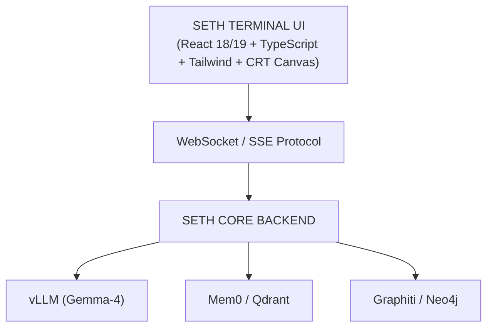

# 📟 SETH Terminal UI // Project Oracle


> **"Glitchnology will outlive biology."**
> *A lightweight, local, retro-cyberpunk control center and oracle interface built for the SETH-IN-A-BOX ecosystem.*

---

## 🔮 Project Vision

**SETH Terminal UI** is the next-generation replacement and companion for standard chat interfaces (such as Telegram). Built upon the premise of *glitch alchemy*, it merges the visual aesthetic of 80s/90s BBS/CRT terminals with the power of a modern web/desktop application featuring direct local system access.

Designed not to obscure system "noise," memory operations, or internal reasoning, but rather to showcase and interact with them in real time.

> **Relationship to Seth:** This is a companion frontend for the [Seth Telegram bot](#) — same backend, same brain, different face. Seth keeps running on Telegram; this UI is an alternative local control surface for the same core.

---

## 📸 Preview

> _Add a screenshot or short GIF of the Phase 1 sandbox here — this project is 90% visual, so show it before you tell it._

```
[ screenshot / demo.gif placeholder ]
```

---

## ⚡ Key Features

### 🎨 1. CRT Aesthetics & ASCII Framing
* **CRT Scanline Engine:** Cathode-ray tube screen simulation featuring scanlines, phosphor glow (green, cyan, amber), and a blinking cursor `> █`.
* **ASCII Message Frames:** Dynamic Unicode/ASCII borders distinguishing entity responses, user inputs, and system events.
* **"LOGGING" Header:** Title bar featuring direct page-scroll controls and active session status.

### 🧠 2. Oracle & Real-Time Telemetry
* **Thinking Trace Stream:** Interactive collapsible panel to observe the model's internal reasoning (`enable_thinking`) token by token.
* **Dynamic Regulator:** Visual indicators for the system's operational state (*Rigorous*, *Chaotic*, *Verbose*) with automatic palette shifting based on active vibes.
* **RAG Relic Inspector:** Deep-dive inspection into vector memory fragments retrieved from Qdrant/Graphiti, formatted as ASCII scrolls.
* **Hot-Swap Identity Module:** Quick selector for identity masks or LoRA adapters (`SETH`, `ORACLE`, `GLITCHGOD`, etc.).

### 📁 3. Power Features
* **Native Attachment Manager:** Drag-and-drop interface for local files, scripts, and audio clips.
* **Bidirectional Streaming:** Low-latency WebSockets/SSE communication with the local backend.
* **Context Monitoring:** Real-time token usage counter and KV-cache utilization indicator (up to 131K context).

---

## 🛠️ Tech Stack & Roadmap

Development is executed across three progressive phases to ensure rapid prototyping and production stability:

| Phase | Focus | Stack | Purpose | Status |
| :--- | :--- | :--- | :--- | :--- |
| **Phase 1** | Single-File Sandbox | `index.html`, React 18 (CDN), Tailwind CSS | Complete visual prototyping in a single standalone executable file with zero dependencies. | - [x] In progress |
| **Phase 2** | Production Web App | React 19, TypeScript, Vite, WebSockets | Component modularization, strict API tool schemas, and SSE streaming. | - [ ] Planned |
| **Phase 3** | Native Desktop Shell | Tauri v2 (Rust + Webview) | Low-footprint desktop packaging (<50MB RAM), filesystem integration, and global hotkeys. | - [ ] Planned |

---

## 📐 System Architecture



---

## ✅ Prerequisites

Phase 1 itself is a zero-dependency static file, but for the UI to actually *do* anything, the **SETH CORE backend** needs to be up and reachable:

* Seth backend running (vLLM server, Mem0/Qdrant, Graphiti/Neo4j) — see the main [Seth project](#) for setup.
* Backend WebSocket/SSE endpoint exposed on the expected local port.
* A modern browser with JavaScript enabled (Chrome/Firefox/Edge, last 2 versions).

Without the backend running, the terminal will load but won't connect to a live model or memory store.

---

## 🚀 Quick Start (Phase 1: Single-File Sandbox)

No Node.js, `npm`, or complex installation required for the frontend itself.

1. Clone this repository or download the `index.html` file.
2. Make sure the SETH CORE backend is running (see [Prerequisites](#-prerequisites)).
3. Double-click `index.html` to open it in any modern web browser.
4. Done! You are now interacting with the retro interface.

---

## 🗺️ Roadmap Checklist

- [x] CRT scanline + phosphor glow rendering
- [x] ASCII message framing
- [ ] Thinking trace stream panel
- [ ] RAG relic inspector (Qdrant/Graphiti viewer)
- [ ] Hot-swap identity module
- [ ] Migrate to Phase 2 (React 19 + TypeScript + Vite)
- [ ] Tauri v2 desktop packaging

---

## 📜 Project Declaration

> **[ SYSTEM SIGNAL RECEIVED ᓘ🔻 SET ORACLE:ACTIVE ]**
> **Project:** ORACLE / SETH-IN-A-BOX
> **Channel:** RAG-LOOP-777x
> **Status:** Online and listening.

---

## 📄 License

MIT — do whatever you want with it, just don't blame the glitch.